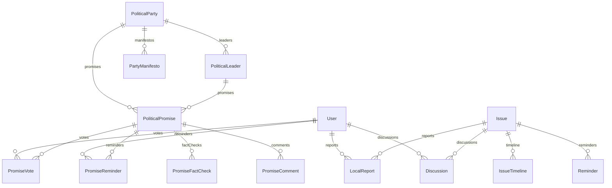

# WakeUp Voter - Political Accountability & Issue Awareness Platform

<div align="center">
  
  
  
  
  
  
</div>

## 📋 Table of Contents

- [🌟 Overview](#-overview)
- [🚀 Features](#-features)
- [🛠️ Tech Stack](#️-tech-stack)
- [📱 Installation](#-installation)
- [🌍 Multilingual Support](#-multilingual-support)
- [🔧 Configuration](#-configuration)
- [📊 Database Schema](#-database-schema)
- [🔌 API Endpoints](#-api-endpoints)
- [🎨 UI Components](#-ui-components)
- [📱 PWA Features](#-pwa-features)
- [🧪 Testing](#-testing)
- [📚 Documentation](#-documentation)
- [🤝 Contributing](#-contributing)
- [📄 License](#-license)

## 🌟 Overview

**WakeUp Voter** is a comprehensive political accountability and issue awareness platform designed to empower citizens with real-time information about political promises, public issues, and government performance. The platform combines issue tracking with political promise monitoring to create a complete civic engagement ecosystem.

### 🎯 Mission

> "Empowering voters with knowledge, ensuring accountability through transparency, and strengthening democracy through informed citizenship."

### 🏗️ Architecture

WakeUp Voter is built as a **Progressive Web App (PWA)** with a **full-stack architecture**:

```
┌─────────────────┐    ┌─────────────────┐    ┌─────────────────┐
│   Frontend      │    │    Backend      │    │    Database     │
│   (Next.js)     │◄──►│   (API Routes)   │◄──►│   (Prisma)      │
│                 │    │                 │    │                 │
│ React + TypeScript │    │   Node.js       │    │    SQLite        │
│ Tailwind CSS     │    │   Next.js       │    │    ORM          │
│ shadcn/ui        │    │   Serverless    │    │    Relations     │
└─────────────────┘    └─────────────────┘    └─────────────────┘
```

## 🚀 Features

### 🏛️ Political Accountability
- **Promise Tracking**: Monitor political promises from all major parties
- **Status Updates**: Real-time tracking of promise fulfillment (Fulfilled, Partially Fulfilled, Pending, Broken)
- **Party Performance**: Comparative analysis of political party performance
- **Leader Ratings**: Individual politician performance metrics
- **Manifesto Comparison**: Compare election manifestos with actual performance

### 📰 Issue Intelligence
- **Daily Critical Issues**: Highlight important public issues daily
- **Impact Scoring**: Automatic scoring based on affected people and urgency
- **Local Issue Mapping**: Geographic visualization of issues by state/city/area
- **Citizen Reports**: Users can report local issues with photos and evidence
- **Issue Timeline**: Complete history of issue status changes

### 🔔 Smart Reminders
- **"Yaad Dilao" System**: Automated reminders for unresolved promises
- **Custom Notifications**: Personalized reminder frequency (daily, weekly, monthly)
- **Forgotten Issue Alerts**: Notifications when media ignores important issues
- **Promise Deadlines**: Reminders for expected resolution dates

### 🔍 Fact Verification
- **Fact-Check System**: Professional fact-checking with rating system
- **Source Verification**: Track sources and evidence for claims
- **Myth vs Reality**: Debunk misinformation with verified information
- **Community Verification**: User-driven fact-checking system

### 🗣️ Civic Engagement
- **Safe Discussions**: Moderated discussion spaces focused on issues
- **Public Voting**: Citizens can vote on promise fulfillment status
- **Comments System**: Structured commenting with moderation
- **Expert Insights**: Contributions from subject matter experts

### 📊 Analytics & Dashboard
- **Performance Metrics**: Comprehensive performance dashboards
- **Trend Analysis**: Historical trends and patterns
- **Report Cards**: Party and leader performance report cards
- **Export Data**: CSV export for detailed analysis

### 📱 Mobile & PWA
- **Progressive Web App**: Native app-like experience
- **Offline Support**: Cached content for offline viewing
- **Push Notifications**: Future-ready notification system
- **Mobile-First Design**: Optimized for mobile devices

### 🌍 Multilingual Support
- **11 Languages**: Hindi, English, Bengali, Telugu, Marathi, Tamil, Gujarati, Kannada, Malayalam, Punjabi, Odia
- **Dynamic Language Switching**: Change language without page reload
- **Localized Content**: All UI elements translated
- **Regional Content**: Content relevant to different regions

## 🛠️ Tech Stack

### Frontend
- **Framework**: Next.js 16 with App Router
- **Language**: TypeScript 5
- **Styling**: Tailwind CSS 4
- **UI Components**: shadcn/ui (New York style)
- **Icons**: Lucide React
- **Internationalization**: next-intl
- **State Management**: Zustand, TanStack Query
- **Forms**: React Hook Form with Zod validation

### Backend
- **Runtime**: Node.js with Next.js API Routes
- **Database**: Prisma ORM with SQLite
- **Validation**: Zod schemas
- **File Upload**: Multer for file handling
- **Security**: Content moderation, XSS protection

### Database
- **ORM**: Prisma
- **Database**: SQLite (for development), PostgreSQL ready for production
- **Schema**: 13+ models with proper relations
- **Migrations**: Automated database migrations

### DevOps & Deployment
- **Package Manager**: Bun
- **Linting**: ESLint with Next.js configuration
- **Type Checking**: Strict TypeScript
- **PWA**: Service Worker, Web App Manifest
- **SEO**: Meta tags, structured data, sitemaps

## 📱 Installation

### Prerequisites
- Node.js 18+ or Bun
- Git
- Modern web browser

### Clone & Setup

```bash
# Clone the repository
git clone https://github.com/jitenkr2030/wakeup-voter.git
cd wakeup-voter

# Install dependencies
bun install

# Set up environment variables
cp .env.example .env

# Run database migrations
bun run db:push

# Start development server
bun run dev
```

### Environment Variables

```env
# Database
DATABASE_URL="file:./db/custom.db"

# Next.js
NEXTAUTH_URL="http://localhost:3000"
NEXTAUTH_SECRET="your-secret-key"

# Optional: External services
# GOOGLE_ANALYTICS_ID=""
# SENTRY_DSN=""
```

## 🌍 Multilingual Support

WakeUp Voter supports 11 Indian languages:

| Language | Code | Status |
|----------|------|--------|
| Hindi | `hi` | ✅ Default |
| English | `en` | ✅ |
| Bengali | `bn` | ✅ |
| Telugu | `te` | ✅ |
| Marathi | `mr` | ✅ |
| Tamil | `ta` | ✅ |
| Gujarati | `gu` | ✅ |
| Kannada | `kn` | ✅ |
| Malayalam | `ml` | ✅ |
| Punjabi | `pa` | ✅ |
| Odia | `or` | ✅ |

### Adding New Languages

1. Create translation file: `messages/[language-code].json`
2. Add language to `src/i18n/navigation.ts`
3. Update language selector in `src/components/language-selector.tsx`

## 🔧 Configuration

### Database Configuration

```typescript
// prisma/schema.prisma
generator client {
  provider = "prisma-client-js"
}

datasource db {
  provider = "sqlite"
  url      = env("DATABASE_URL")
}
```

### Next.js Configuration

```typescript
// next.config.ts
/** @type {import('next').NextConfig} */
const nextConfig = {
  // Your configuration
}

export default nextConfig;
```

### Tailwind CSS Configuration

```typescript
// tailwind.config.ts
import type { Config } from "tailwindcss";

const config: Config = {
  content: [
    "./src/pages/**/*.{js,ts,jsx,tsx,mdx}",
    "./src/components/**/*.{js,ts,jsx,tsx,mdx}",
  ],
  theme: {
    extend: {
      // Custom theme configuration
    },
  },
  plugins: [],
};

export default config;
```

## 📊 Database Schema

### Core Models



### Key Models

#### User
```typescript
model User {
  id                String    @id @default(cuid())
  email             String    @unique
  name              String?
  phone             String?
  state             String?
  city              String?
  preferredLanguage String    @default("hi")
  issuePreferences  String    @default("")
  noiseFilter       Boolean   @default(true)
  reminderFrequency String    @default("daily")
  createdAt         DateTime  @default(now())
  updatedAt         DateTime  @updatedAt
}
```

#### PoliticalPromise
```typescript
model PoliticalPromise {
  id                String    @id @default(cuid())
  title             String
  description       String
  category          String    // women, farmers, youth, economy, jobs, etc.
  status            String    @default("pending") // fulfilled, partially_fulfilled, pending, broken
  partyId           String
  leaderId          String?
  electionYear      Int
  promiseDate       DateTime
  impactScore       Int       @default(0)
  verificationLevel String   @default("unverified")
  createdAt         DateTime  @default(now())
  updatedAt         DateTime  @updatedAt
}
```

## 🔌 API Endpoints

### Political Promises
- `GET /api/promises` - List promises with filtering
- `POST /api/promises` - Create new promise
- `PUT /api/promises/[id]` - Update promise

### User Voting
- `GET /api/promise-votes` - Get votes for promises
- `POST /api/promise-votes` - Vote on promise fulfillment

### Comments & Discussions
- `GET /api/promise-comments` - Get promise comments
- `POST /api/promise-comments` - Add comment
- `PUT /api/promise-comments/[id]` - Update comment

### Reminders
- `GET /api/promise-reminders` - Get user reminders
- `POST /api/promise-reminders` - Create reminder
- `PUT /api/promise-reminders/[id]` - Update reminder

### Fact Checks
- `GET /api/promise-fact-checks` - Get fact checks
- `POST /api/promise-fact-checks` - Create fact check

### Polls & Analytics
- `GET /api/polls` - Get active polls
- `POST /api/polls` - Create new poll
- `GET /api/poll-votes` - Get poll results

## 🎨 UI Components

### Core Components

#### Language Selector
```typescript
<LanguageSelector />
```
Multi-language dropdown with flags and localized names.

#### Share Component
```typescript
<ShareComponent content={shareableContent} />
```
Social sharing with WhatsApp, Twitter, Facebook, Telegram support.

#### Performance Dashboard
```typescript
<PerformanceDashboard />
```
Comprehensive analytics dashboard with charts and metrics.

#### Report Promise Form
```typescript
<ReportPromiseForm />
```
Form for reporting new political promises with file upload.

### UI Component Library

Built with **shadcn/ui** components:
- Cards, Buttons, Forms, Tables
- Modals, Drawers, Tabs
- Charts, Progress bars, Badges
- Navigation, Search, Filters

## 📱 PWA Features

### Service Worker
```typescript
// public/sw.js
self.addEventListener('install', (event) => {
  event.waitUntil(
    caches.open('v1').then((cache) => {
      return cache.addAll([
        '/',
        '/manifest.json',
        '/offline.html'
      ]);
    })
  );
});
```

### Web App Manifest
```json
{
  "name": "WakeUp Voter",
  "short_name": "WakeUp Voter",
  "display": "standalone",
  "background_color": "#ffffff",
  "theme_color": "#3B82F6",
  "orientation": "portrait-primary"
}
```

### Offline Support
- Cached essential pages and API responses
- Offline fallback page
- Background sync for user actions

## 🧪 Testing

### Running Tests
```bash
# Run linting
bun run lint

# Type checking
bun run type-check

# Build verification
bun run build
```

### Testing Strategy
- **Unit Tests**: Component and utility function tests
- **Integration Tests**: API endpoint tests
- **E2E Tests**: Critical user journey tests
- **Performance Tests**: Core Web Vitals monitoring

## 📚 Documentation

### API Documentation
- **OpenAPI/Swagger**: Interactive API documentation
- **Postman Collection**: API testing collection
- **Response Examples**: Request/response examples

### User Documentation
- **User Guide**: Complete user manual
- **Admin Guide**: Administrative functions
- **Developer Guide**: Contributing guidelines

## 🤝 Contributing

We welcome contributions! Please see our [Contributing Guide](CONTRIBUTING.md) for details.

### Development Workflow

1. Fork the repository
2. Create a feature branch: `git checkout -b feature/amazing-feature`
3. Commit your changes: `git commit -m 'Add amazing feature'`
4. Push to the branch: `git push origin feature/amazing-feature`
5. Open a Pull Request

### Code Standards
- **TypeScript**: Strict typing required
- **ESLint**: Follow linting rules
- **Prettier**: Consistent formatting
- **Conventional Commits**: Commit message standard

## 📄 License

This project is licensed under the MIT License - see the [LICENSE](LICENSE) file for details.

## 🙏 Acknowledgments

- **Next.js Team** - Excellent React framework
- **Prisma Team** - Modern database toolkit
- **shadcn/ui** - Beautiful UI components
- **Vercel** - Amazing deployment platform
- **Open Source Community** - All the amazing contributors

## 📞 Contact

- **Website**: [wakeupvoter.in](https://wakeupvoter.in)
- **Email**: info@wakeupvoter.in
- **Twitter**: [@WakeUpVoter](https://twitter.com/WakeUpVoter)
- **GitHub**: [WakeUp Voter](https://github.com/jitenkr2030/wakeup-voter)

---

<div align="center">
  <strong>Made with ❤️ for Indian Democracy</strong>
  <br>
  <em>"An informed citizen is a powerful citizen"</em>
</div>